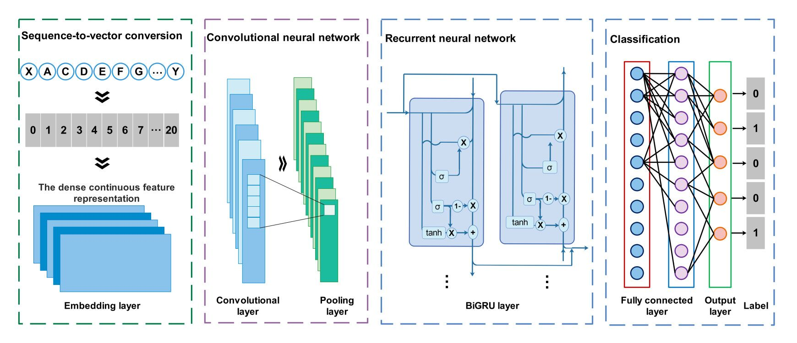

# MLBP
Identifying bioactive peptide function using multi-label deep learning

# Introduction
We develop a tool based on deep learning that predict bioactive peptide function.  

## Contact
Please feel free to contact us if you need any help.

